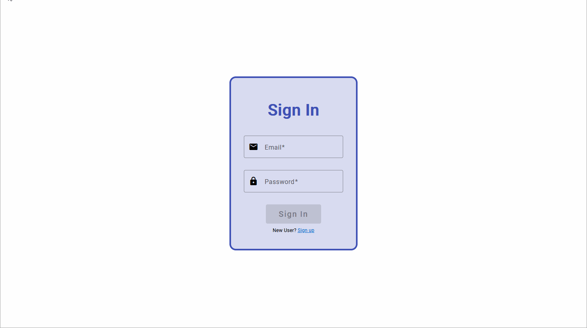
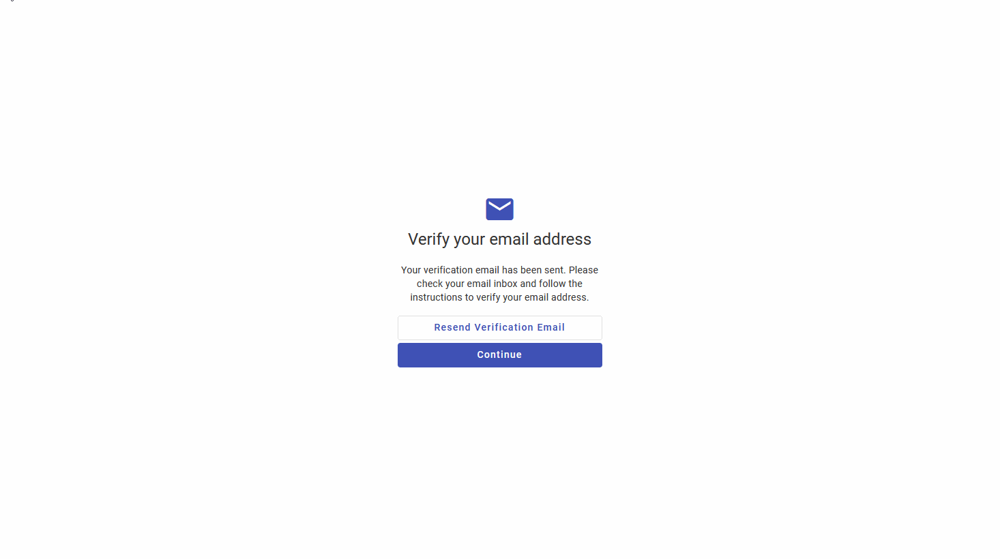
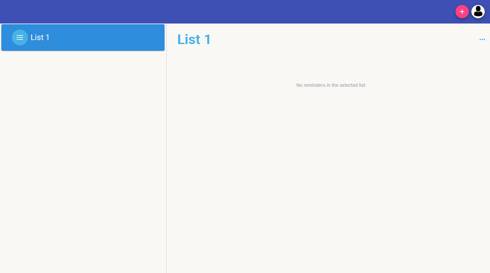

# reminders

A task management application inspired by Apple's Reminders. It simplifies task management by allowing users to create, manage, and organize reminders, all securely stored on the server for convenient access across all devices.

## 🛠️ Technologies:

- `Angular`
- `RxJs`
- `Firebase`
- `Angular Material`
- `Sass`
- `TypeScript`
- `HTML`
- `CSS`

## ✨ Features:

- Authentication
- Persistent Sessions
- Profile Customization and Management
- Reminder and List Management
- Cross-Device Syncing
- Due Dates and Notes
- Real-Time Updates
- Responsive Design
- Secure Data Access
- Animations
- Notifications

## 📋 Functionality Overview:

- **Signing up**

  Upon launching the application, users are greeted with a sign-in page housing a user-friendly form. For newcomers, accessing the platform is straightforward—simply click the "Sign Up" link to navigate to the registration page. Upon completion of the sign-in form, a verification email is dispatched to the provided email address and users are directed to the verification page.
  

- **Verification**

  The Verification page allows users to proceed with the verification process. To continue, users must confirm their account by following the link sent via email. After following the link, users can return to the application and click "Continue" to be redirected to the home page. If verification via email is pending, users receive a notification. They can choose to resend the verification email if needed. Notifications also inform users when a new email is sent for verification.
  

- **Lists**

  Users have full control over their lists, including the ability to create, edit, and remove them. To initiate the creation of a new list, users simply click the "+" button located on the navbar. Subsequently, they select the 'Add a list' option from the displayed menu. Here, users are prompted to specify the list's name, color, and icon according to their preferences. Upon completion, users confirm the creation of the list by clicking the 'Add list' button. Users can effortlessly access any of their lists by clicking on the banner of the respective list. Upon selection, the list view is presented, showcasing the list's name along with its associated reminders. For added convenience, users can manage the list by clicking on the three dots located within the list's view, enabling them to perform actions such as editing or removing the list.
  

- **Reminders**

  Users have full control over their reminders, enabling them to create, edit, and remove them effortlessly. To create a new reminder, users simply click the "+" button on the navbar and select 'Add a reminder' from the menu. They can then specify details such as the reminder's name, description, due date and time, and assign it to a parent list. Confirmation of the reminder creation is completed by clicking the 'Add reminder' button. For easy management, users can edit or delete reminders by clicking the info button on the right side of the reminder banner and selecting the desired option. The due dates of reminders that have passed are displayed in red for quick identification. Users can also mark reminders as complete by toggling the circle on the reminder banner. To view completed reminders, users can toggle the respective option in the list view settings.
  

- **Profiles**

  Users can manage their profile conveniently by clicking the profile button on the navbar. From there, they can choose to edit their profile, sign out, or delete their account. In the edit profile menu, users have the option to change their username and avatar. Upon selecting the sign-out option, users are logged out and redirected to the sign-in page. If users decide to delete their account, they will be prompted to enter their credentials for verification. A notification will then inform them whether the account deletion was successful or if the provided credentials were incorrect.
  

  ## 🚀 Live Application

  Explore the live version of the application [here](https://reminders-4f421.web.app/sign-in).
